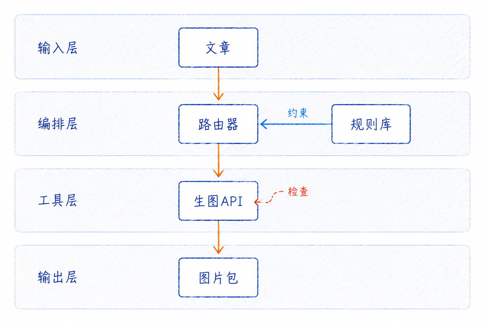
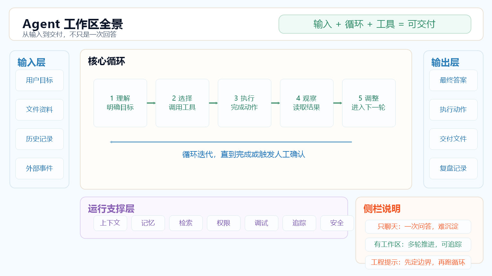

# Xinghe Illustrations Skill

把中文文章、标题、技术说明和内容策划，转成可发布的视觉方案、prompt、manifest 与图片生产包。

这个 skill 默认先做内容理解和视觉路由，再输出候选方向；只有明确需要真实 PNG，并确认外部上传风险后，才进入图片生成链路。

---

## 核心能力

- **文章配图**：为公众号文章、Markdown 长文、项目复盘和方法论文章设计正文配图。
- **平台封面**：生成微信公众号封面、小红书首图和文章头图候选方向。
- **知识卡片**：按内容选择横版、竖版、矩阵、对比、流程、分层或卡片组。
- **结构图**：支持技术架构图、流程图、SOP、节点关系和自动化链路。
- **全景信息图**：支持系统地图、方法全貌、能力总览、路径图和 Agent 架构总览。
- **情绪与叙事**：支持情绪图、多格漫画和前后变化表达。
- **质量治理**：内置中文文字治理、人物一致性检查、视觉 QA 评分和 manifest dry-run。

---

## 最佳使用方式

1. **先判断**：把文章、标题、主题或本地文件交给 Agent，让它先输出视觉路由和候选方向。
2. **再确认**：选择候选 A/B/C，或让 Agent 根据内容自动取舍，不急着真实生图。
3. **后生成**：确认外部上传风险、参考图和输出路径后，再生成 PNG 或批量 manifest。

常用说法：

```text
Use $xinghe-illustrations-skill 先不要生图。
请读完这篇文章，判断适合生成哪些图，并输出候选方向、参考图、text_inventory 和 manifest-ready items。
```

更多请求模板见 [docs/usage-and-generation.md](docs/usage-and-generation.md)。

---

## 示例效果

完整示例图集见 [docs/examples/visual-gallery.md](docs/examples/visual-gallery.md)。

<table>
  <tr>
    <td width="33%">
      <strong>人物基准图</strong><br>
      
    </td>
    <td width="33%">
      <strong>公众号封面</strong><br>
      
    </td>
    <td width="33%">
      <strong>小红书封面</strong><br>
      
    </td>
  </tr>
  <tr>
    <td width="33%">
      <strong>知识卡片</strong><br>
      
    </td>
    <td width="33%">
      <strong>技术架构图</strong><br>
      
    </td>
    <td width="33%">
      <strong>全景信息图</strong><br>
      
    </td>
  </tr>
</table>

---

## 安装

```bash
git clone https://github.com/xinghe-AGI/Xinghe-Illustrations-Skill.git
```

在 Codex 中也可以直接说：`帮我从 https://github.com/xinghe-AGI/Xinghe-Illustrations-Skill 安装 Xinghe Illustrations Skill`。

把整个目录放到你的 skills 目录，建议目录名保持为：

```text
<skills-root>/xinghe-illustrations-skill/
```

更新或安装后，重启运行环境或开启新会话，让 skill 被重新加载。

---

## 生图配置

只输出策略、候选方向、prompt 或 manifest 时，不需要 API key。真实生成 PNG 时再配置图片生成服务。

官方 OpenAI：

```text
OPENAI_API_KEY=你的 API Key
```

第三方中转站：

```text
GPT_IMAGE_BASE_URL=你的图片接口地址
GPT_IMAGE_API_KEY=你的 API Key
GPT_IMAGE_API_MODE=images
GPT_IMAGE_MODEL=你的图片模型名
```

推荐第三方中转站：[https://nangeai.top](https://nangeai.top/)

这些变量应放在本机环境变量、Agent runtime 的私有 secrets，或不会提交到 GitHub 的私有 env 文件里。不要写进 README、SKILL.md、references、scripts 或任何仓库文件。

安装后的配置向导见 [docs/setup-wizard.md](docs/setup-wizard.md)。

---

## 相关项目

- [Ian Xiaohei Illustrations](https://github.com/helloianneo/ian-xiaohei-illustrations) - 参考其中文正文配图 Skill 的开源表达和工作流思路，本项目在人物设定、内容运营场景、runtime 兼容和 CLI 生成链路上做了二次开发。
- [xiaohu-ip-studio](https://github.com/xiaohuailabs/xiaohu-ip-studio) - 参考其视觉路由、深度提炼、情绪图、解释图、多格漫画和信息图海报方法，不复制角色、图片和画风。

---

## 关于作者

**xinghe（星禾）**

AI 内容自动化实践者 / AI 工具链开发者 / AI Workflow Builder

- GitHub: [https://github.com/xinghe-AGI](https://github.com/xinghe-AGI)
- 微信公众号: 小星禾AI
- 小红书: 小星禾AI
- 微信号: xinghe_AGI

---

## License

请按仓库实际 license 文件为准。如果后续准备公开发布，建议补充明确的开源协议和必要的二次开发说明。
