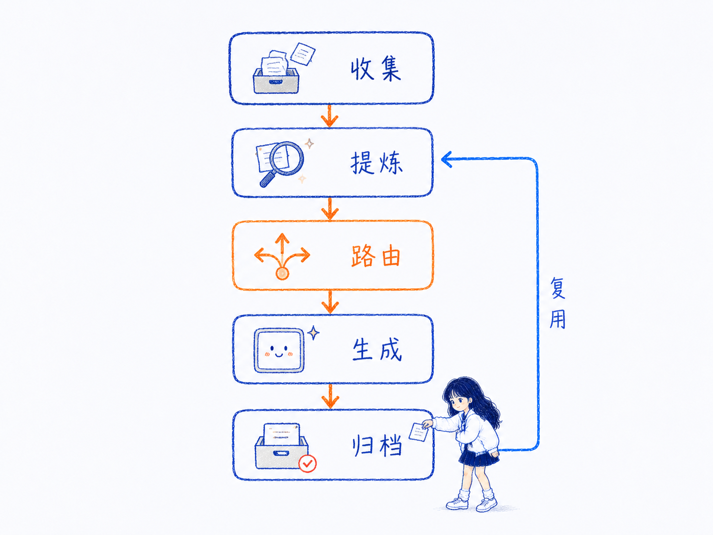
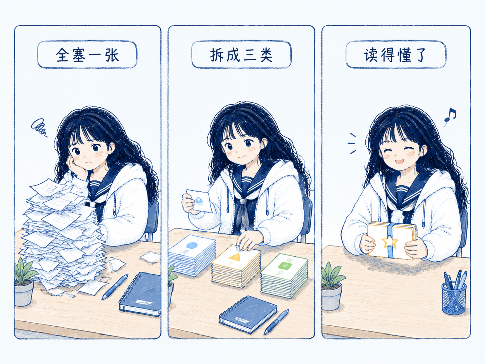
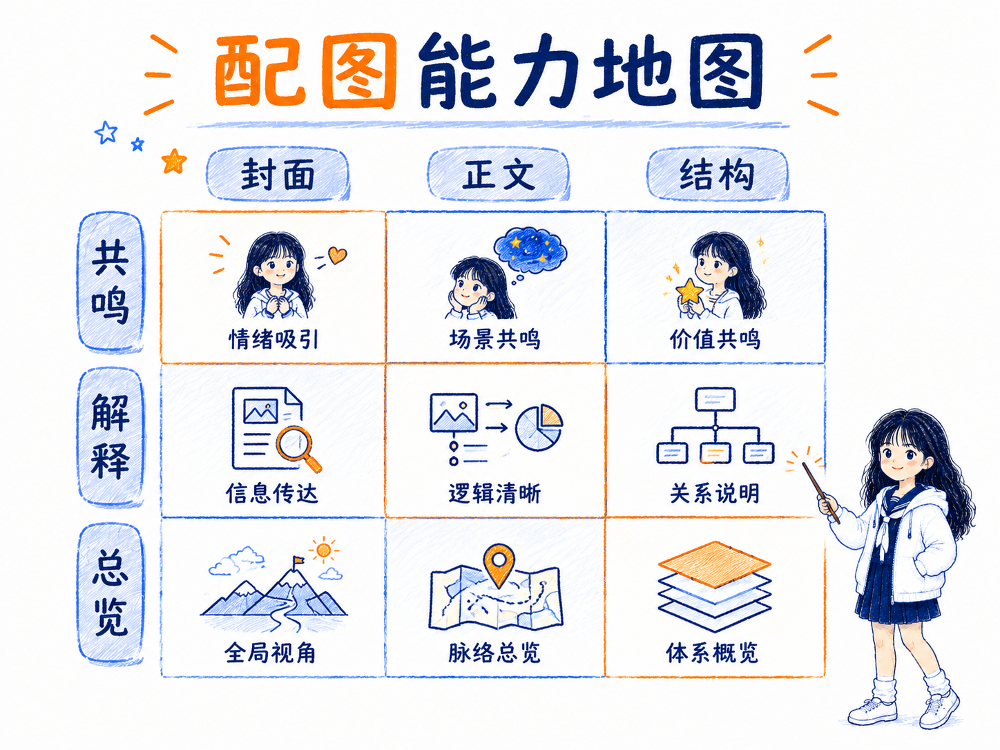
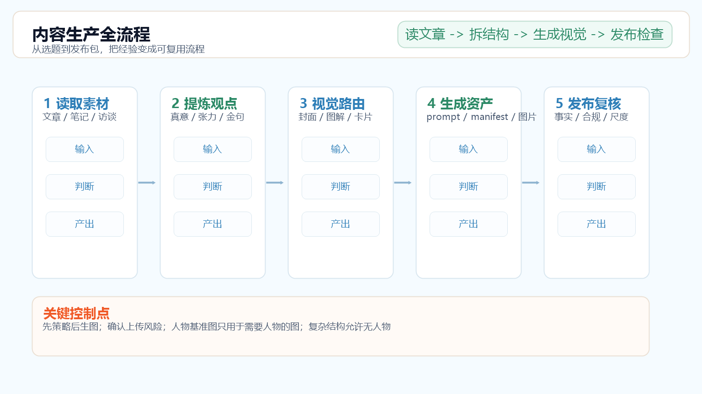
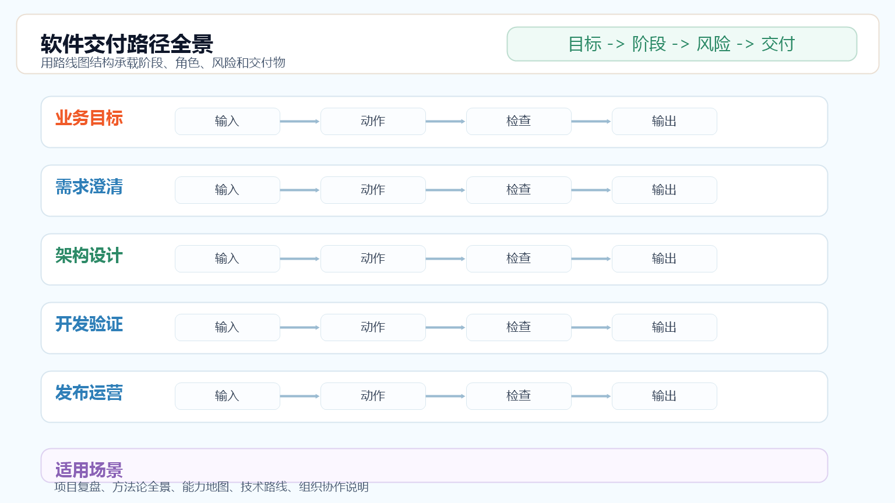

# Xinghe Illustrations Skill

> 先读懂文章，再判断应该生成什么图。

Xinghe Illustrations Skill 用于把中文内容转成可发布的视觉方案、prompt、manifest 和图片资产，适合文章配图、公众号封面、小红书封面、情绪图、解释图、知识卡片、技术架构图、流程图、多格漫画、信息图和高密度全景图。

---

## 功能简要

- **内容视觉路由**：读完文章后先判断适合生成什么图，而不是默认套一种模板。
- **平台封面**：支持微信公众号横版封面、小红书竖版封面和文章头图。
- **正文配图**：按文章小节提取配图点，输出多个候选方向。
- **知识卡片**：根据内容选择横版、竖版、矩阵、对比、流程、分层或总结卡片。
- **结构表达**：支持技术架构图、流程图、SOP、节点关系和自动化链路。
- **全景信息图**：支持系统地图、方法全貌、能力总览、路径图和 Agent 架构总览。
- **情绪与叙事**：支持情绪图、多格漫画和前后变化类表达。
- **生成落地**：默认先输出策略和 prompt；需要真实生图时可生成 PNG 与 manifest。
- **质量检查**：检查人物一致性、文字可读性、信息层级、构图密度和发布风险。

---

## 最佳使用方式

最稳的方式是先让 Agent 判断图型，再确认生成方向：

1. 把文章、标题、主题或本地文件交给 Agent。
2. 让它先输出视觉路由和候选方向，不要直接生图。
3. 选择候选 A/B/C，或要求它按内容自动取舍。
4. 需要真实 PNG 时，确认外部上传风险和参考图可用，再生成。
5. 生成后检查中文文字、人物一致性、信息密度和平台适配。

| 场景 | 推荐说法 |
|---|---|
| 让 skill 自主判断图型 | `请读完这篇文章，判断适合生成哪些图，先不要生图。` |
| 做文章正文配图 | `请给这篇文章 3-7 个配图选点，每个点给 A/B 候选方向。` |
| 做公众号封面 | `请为这篇文章做 3 个公众号封面候选方向。` |
| 做小红书封面 | `请为这个标题做 3 个小红书首图候选方向。` |
| 做知识卡片 | `请把这篇文章整理成知识卡片，按内容判断横版还是竖版。` |
| 做架构图或流程图 | `请把这段说明设计成技术架构图或流程图，人物可以小一点或不出现。` |
| 做高密度全景图 | `请把这篇文章做成一张全景信息图，先判断分区、阅读路径和人物是否需要出现。` |
| 真实生成图片 | `我确认生成候选 A，请先 inspect，再生成 PNG。` |

更完整的请求模板、manifest、inspect 和 dry-run 示例见 [docs/usage-and-generation.md](docs/usage-and-generation.md)。
安装后的 URL、API key 和首次验证流程见 [docs/setup-wizard.md](docs/setup-wizard.md)。

---

## 产出核心结构

这个 skill 的核心不是“套模板生成一张图”，而是把内容转成一套稳定的视觉生产结构：

1. **内容理解**：提炼主题、真意、冲突、关键术语和必须保留的数字。
2. **视觉路由**：判断应该做封面、正文图、情绪图、解释图、知识卡片、架构图、流程图、漫画还是信息图。
3. **版式组织**：根据内容选择横版、竖版、对比、流程、分层、矩阵、总分或卡片组。
4. **生成落地**：先给候选方向和 prompt，确认后再生成图片或导出 manifest。

字段规范和输出包结构见 [references/output-spec.md](references/output-spec.md)。

---

## 示例效果

完整示例图集见 [docs/examples/visual-gallery.md](docs/examples/visual-gallery.md)。

### IP 基准图

<table>
  <tr>
    <td width="40%">
      
    </td>
    <td>
      含人物的真实生图必须传入这张人物基准图，用来保持人物发型、服装、气质和整体识别度稳定。
    </td>
  </tr>
</table>

### 封面图

<table>
  <tr>
    <td width="33%">
      <strong>公众号封面：左标题右动作</strong><br>
      
    </td>
    <td width="33%">
      <strong>小红书封面：大字标题</strong><br>
      
    </td>
    <td width="33%">
      <strong>小红书封面：方法栈</strong><br>
      
    </td>
  </tr>
</table>

### 正文图与情绪图

<table>
  <tr>
    <td width="33%">
      <strong>正文图</strong><br>
      
    </td>
    <td width="33%">
      <strong>情绪图：慌张</strong><br>
      
    </td>
    <td width="33%">
      <strong>情绪图：烦躁</strong><br>
      
    </td>
  </tr>
</table>

### 解释图、知识卡片与结构图

<table>
  <tr>
    <td width="33%">
      <strong>解释图</strong><br>
      
    </td>
    <td width="33%">
      <strong>知识卡片</strong><br>
      
    </td>
    <td width="33%">
      <strong>技术架构图</strong><br>
      
    </td>
  </tr>
</table>

### 流程图、漫画与信息图

<table>
  <tr>
    <td width="33%">
      <strong>流程图</strong><br>
      
    </td>
    <td width="33%">
      <strong>多格漫画</strong><br>
      
    </td>
    <td width="33%">
      <strong>信息图</strong><br>
      
    </td>
  </tr>
</table>

### 全景信息图

<table>
  <tr>
    <td width="33%">
      <strong>Agent 工作区全景</strong><br>
      
    </td>
    <td width="33%">
      <strong>内容生产全流程</strong><br>
      
    </td>
    <td width="33%">
      <strong>软件交付路径全景</strong><br>
      
    </td>
  </tr>
</table>

---

## 安装

```bash
git clone https://github.com/xinghe-AGI/Xinghe-Illustrations-Skill.git
```

把整个目录放到你的 skills 目录，建议目录名保持为：

```text
<skills-root>/xinghe-illustrations-skill/
```

更新或安装后，重启运行环境或开启新会话，让 skill 被重新加载。

---

## 生图配置

只输出策略和 prompt 时不需要 API key。只有需要真实生成 PNG 时，才需要配置图片生成服务。

### 官方 OpenAI

配置环境变量：

```text
OPENAI_API_KEY=你的 API Key
```

### 第三方中转站

配置兼容 OpenAI 图片接口的地址和密钥：

```text
GPT_IMAGE_BASE_URL=你的图片接口地址
GPT_IMAGE_API_KEY=你的 API Key
GPT_IMAGE_API_MODE=images
GPT_IMAGE_MODEL=你的图片模型名
```

这些变量应放在本机环境变量、Agent runtime 的私有 secrets，或不会提交到 GitHub 的私有 env 文件里。不要写进 README、SKILL.md、references、scripts 或任何仓库文件。

含人物的真实生图必须能上传人物基准图：

```text
assets/examples/00-xinghe-ip-baseline.png
```

如果图片服务不能上传人物基准图，可以先停在 prompt-only，或只生成无人物/小人物的技术架构图、流程图、知识卡片和信息图。

安装后的配置向导见 [docs/setup-wizard.md](docs/setup-wizard.md)，完整 inspect 检查和生成命令见 [docs/usage-and-generation.md](docs/usage-and-generation.md)。

---

## 相关项目

- [Ian Xiaohei Illustrations](https://github.com/helloianneo/ian-xiaohei-illustrations) - 参考其中文正文配图 Skill 的开源表达和工作流思路，本项目在人物设定、内容运营场景、runtime 兼容和 CLI 生成链路上做了二次开发。
- [xiaohu-ip-studio](https://github.com/xiaohuailabs/xiaohu-ip-studio) - 参考其视觉路由、深度提炼、情绪图、解释图、多格漫画和信息图海报方法，不复制角色、图片和画风。

---

## 关于作者

**xinghe（星禾）**

AI 内容自动化实践者 / AI 工具链开发者 / AI Workflow Builder

- GitHub: [https://github.com/xinghe-AGI](https://github.com/xinghe-AGI)
- 微信公众号: 小星禾AI
- 小红书: 小星禾AI
- 微信号: xinghe_AGI

---

## License

请按仓库实际 license 文件为准。如果后续准备公开发布，建议补充明确的开源协议和必要的二次开发说明。
