# 星禾示例图集

这个文件集中展示 `assets/examples/` 下的示例图。README 首页只展示精选图片，这里用于完整浏览不同视觉形态的构图方向。

这些图片用于参考构图、信息层级、人物参与方式和平台比例，不要求每次复刻同一种画风。

## README 专用生成样张

这些图片位于 `assets/readme-showcase/`，用于 README 首页展示。它们是用本 skill 的规则重新生成的样张，不是 `assets/examples/` 的构图参考图。

| 类型 | 示例 |
|---|---|
| 正文图 | 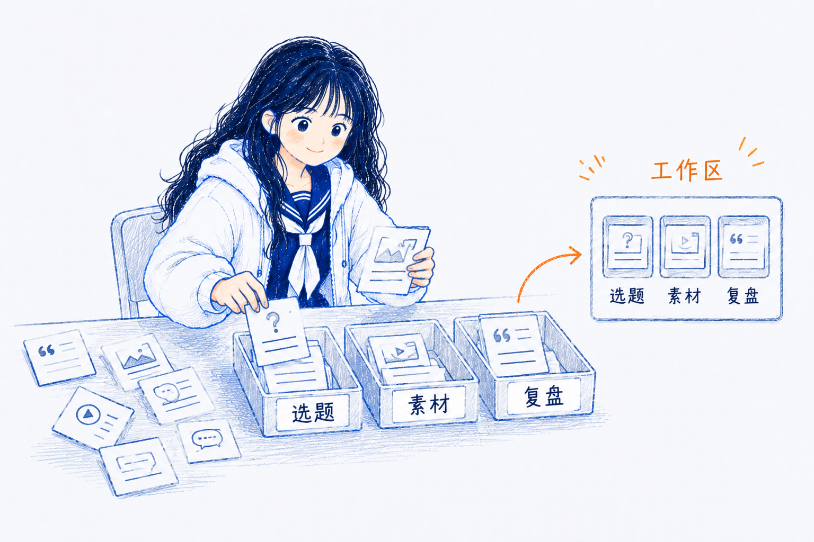 |
| 情绪图：低落 | 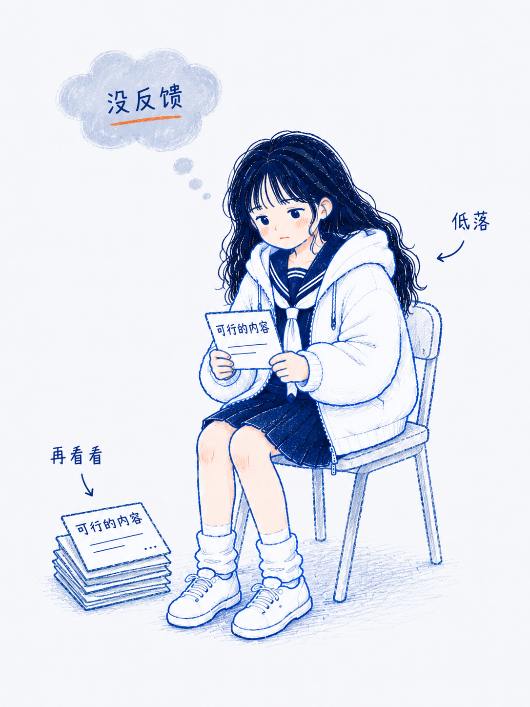 |
| 情绪图：慌张 |  |
| 情绪图：烦躁 | 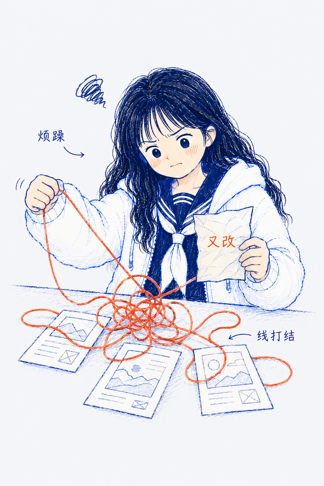 |
| 情绪图：迷茫 | 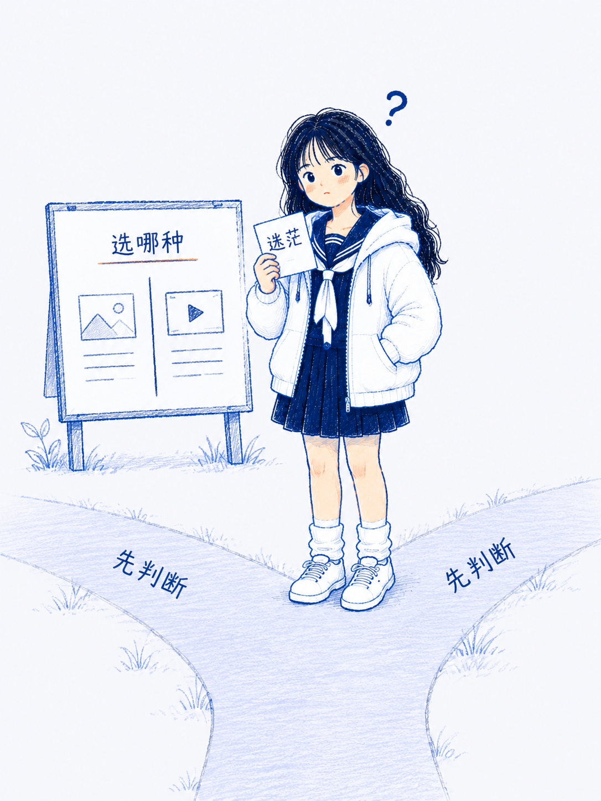 |
| 情绪图：专注 |  |
| 情绪图：释然 | 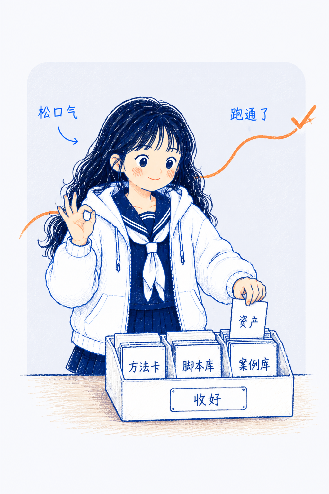 |
| 解释图：输入到生成 | 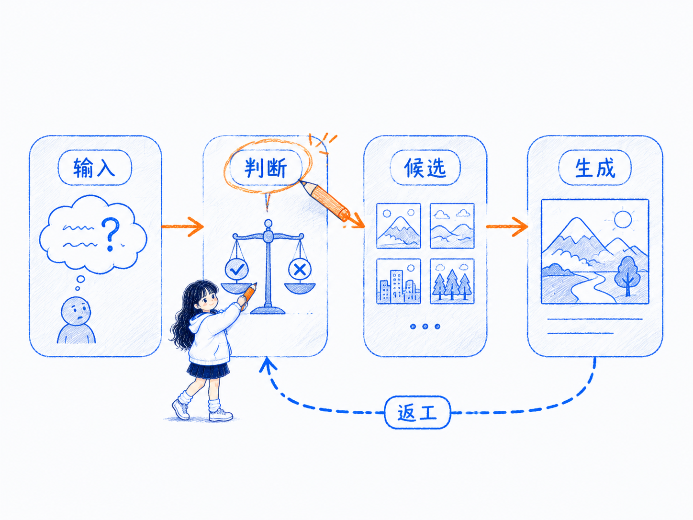 |
| 解释图：先做路由 | 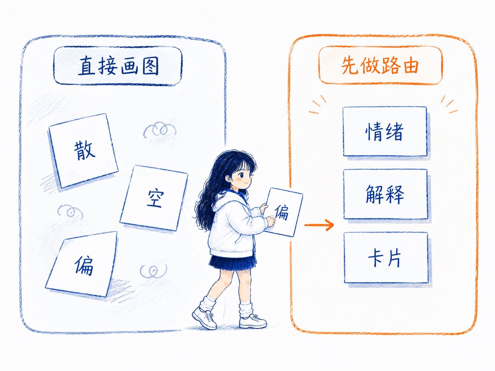 |
| 知识卡片：形态选择 | 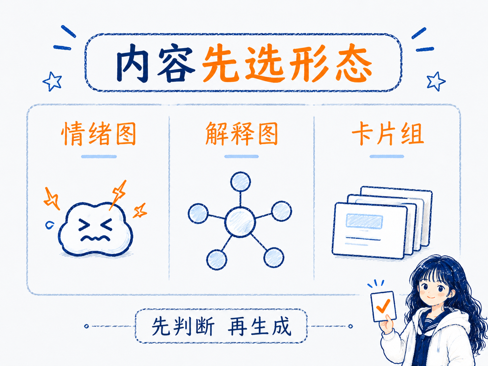 |
| 知识卡片：决策树 | 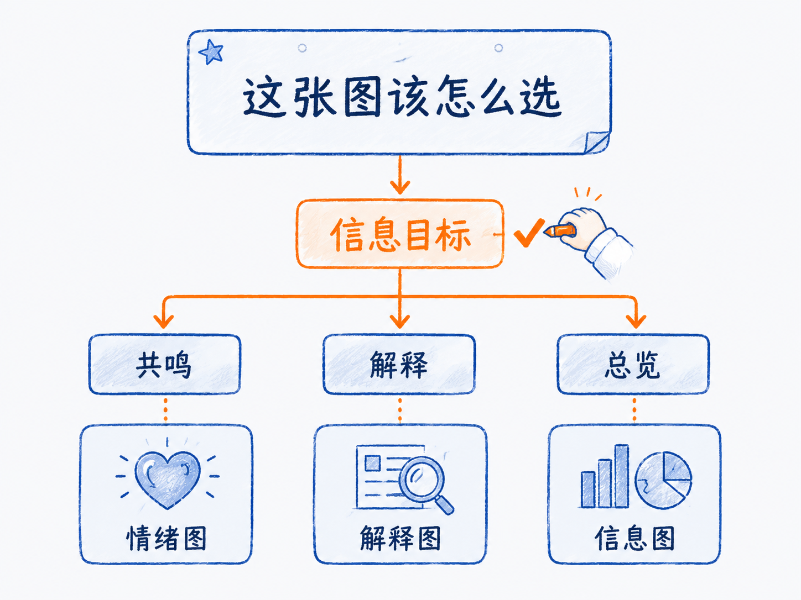 |
| 知识卡片：矩阵 | 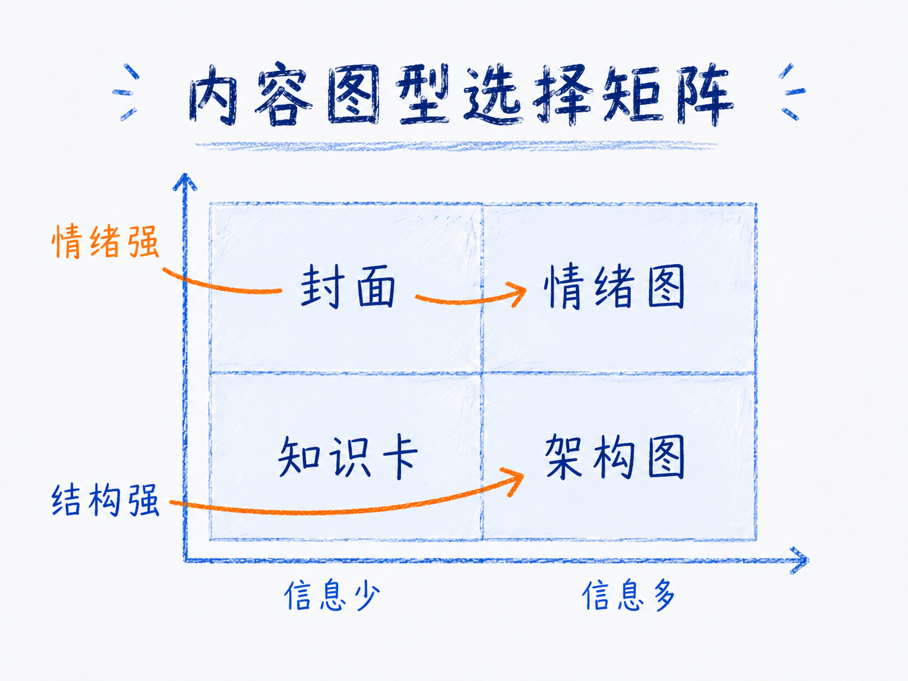 |
| 技术架构图 | 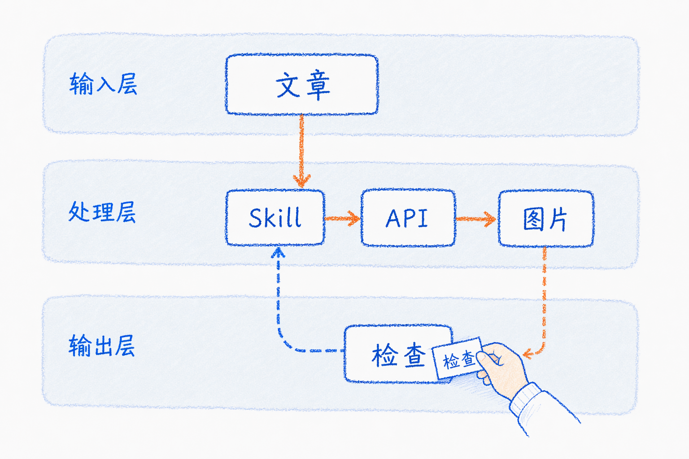 |
| 流程图 | 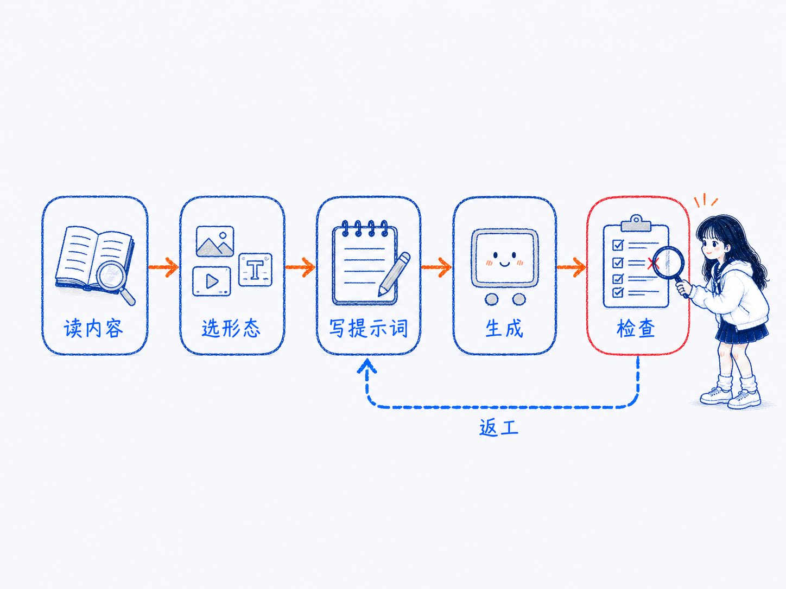 |
| 多格漫画 | 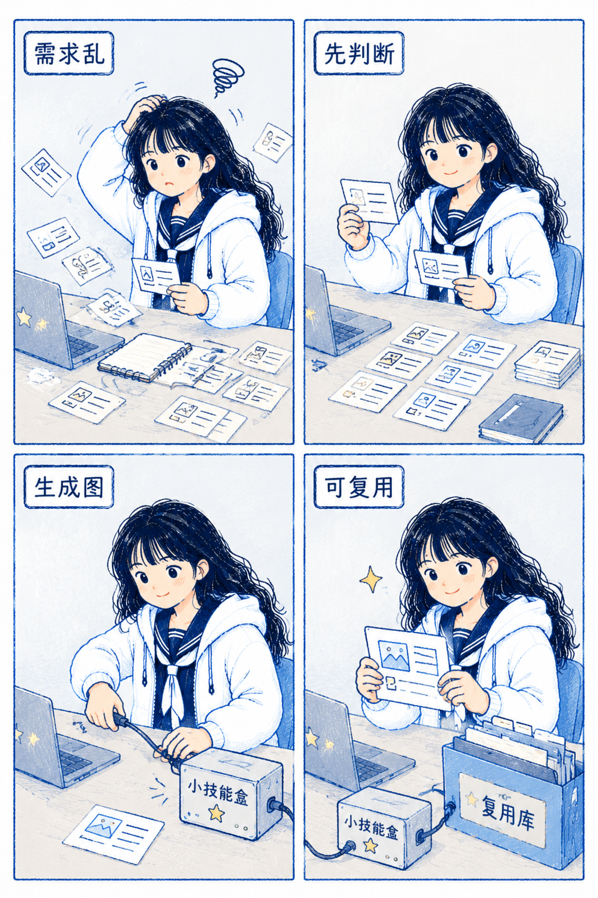 |
| 信息图 | 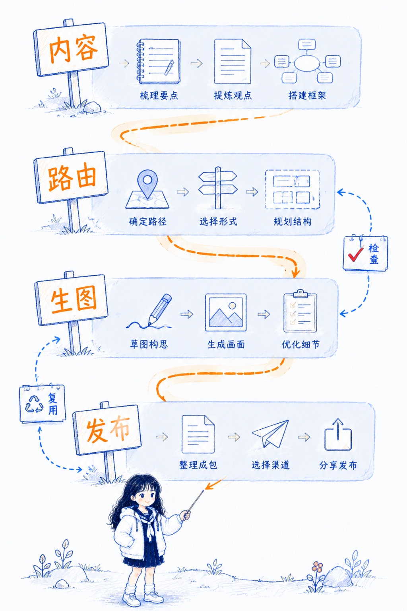 |

## 星禾人物基准

| 类型 | 示例 |
|---|---|
| 人物基准图 |  |

## 解释图 / 正文结构图

适合解释机制、流程、承接路径、内容工作台、系统关系和结构化方法。

| 示例 | 图片 |
|---|---|
| 两个断点 |  |
| 最小闭环 |  |
| 按用途分拣 |  |
| 一鱼多吃 |  |
| 承接路径 |  |
| 三个来源 |  |
| 三个内容工作 |  |
| 交接文案工具箱 |  |

## 情绪图 / 卡点表达

适合表达混乱、卡住、过载、转折、压缩、发酵和“终于理顺”的情绪变化。

| 示例 | 图片 |
|---|---|
| 常见坑位 |  |
| 信息井 |  |
| 想法压机 |  |
| 内容发酵 |  |
| 系统承重 |  |
| 信任桥 |  |

## 微信公众号封面

适合横版头图、文章首屏封面和公众号列表场景。

| 示例 | 图片 |
|---|---|
| 左标题右行动 |  |
| 宽留白单物件 |  |
| 流程线封面 |  |

## 小红书封面

适合 3:4 竖向首图、大字标题、方法栈、关键词强调和收藏型封面。

| 示例 | 图片 |
|---|---|
| 大字标题 + 底部星禾 |  |
| 关键词下划线卡片 |  |
| 方法栈封面 |  |
